# 03 - Database Documentation

## Source of Truth

- Primary schema evidence: `application/models/create_table_dump.sql`
- Total discovered tables: **54**

## Tables Discovered (with detectable columns)

| Table | Detectable Columns (sample) |
|---|---|
| `account_sessions` | `id`, `ip_address`, `timestamp`, `data` |
| `benefits_list` | `id`, `name`, `notes`, `leave`, `ee_account_title`, `er_account_title`, `active`, `trash` |
| `calendar` | `id`, `company_id`, `calendar_date`, `is_holiday`, `holiday_type`, `premium`, `notes`, `repeat_yearly` |
| `companies_list` | `id`, `theme`, `name`, `address`, `phone`, `notes`, `default`, `trash` |
| `companies_options` | `company_id`, `key`, `value` |
| `companies_period` | `id`, `company_id`, `name`, `year`, `start`, `end`, `working_hours` |
| `deductions_list` | `id`, `name`, `notes`, `account_title`, `active`, `trash`, `abbr` |
| `earnings_list` | `id`, `name`, `notes`, `account_title`, `active`, `trash`, `abbr` |
| `employees` | `name_id`, `company_id`, `group_id`, `position_id`, `area_id`, `hired`, `regularized`, `status`, `...` |
| `employees_absences` | `id`, `name_id`, `date_absent`, `hours`, `leave_type`, `notes`, `pe_id` |
| `employees_areas` | `id`, `company_id`, `trash`, `notes`, `name` |
| `employees_attendance` | `name_id`, `date_present`, `hours`, `notes`, `pe_id` |
| `employees_benefits` | `id`, `company_id`, `name_id`, `benefit_id`, `employee_share`, `employer_share`, `start_date`, `primary`, `...` |
| `employees_benefits_templates` | `eb_id`, `template_id` |
| `employees_contacts` | `name_id`, `phone_number`, `cell_number`, `address` |
| `employees_deductions` | `id`, `company_id`, `name_id`, `deduction_id`, `amount`, `max_amount`, `start_date`, `computed`, `...` |
| `employees_deductions_templates` | `ed_id`, `template_id` |
| `employees_earnings` | `id`, `company_id`, `name_id`, `earning_id`, `amount`, `max_amount`, `start_date`, `computed`, `...` |
| `employees_earnings_templates` | `ee_id`, `template_id` |
| `employees_groups` | `id`, `company_id`, `name`, `notes`, `trash` |
| `employees_leave_benefits` | `id`, `company_id`, `name_id`, `benefit_id`, `days`, `year` |
| `employees_overtime` | `id`, `name_id`, `date_overtime`, `minutes`, `notes`, `pe_id` |
| `employees_positions` | `id`, `company_id`, `name`, `notes`, `trash` |
| `employees_salaries` | `id`, `company_id`, `name_id`, `amount`, `rate_per`, `days`, `annual_days`, `months`, `...` |
| `employees_timesheets` | `id`, `name_id`, `calendar_date`, `time_in`, `time_out` |
| `names_info` | `name_id`, `lastname`, `firstname`, `middlename`, `birthday`, `birthplace`, `gender`, `civil_status`, `...` |
| `names_list` | `id`, `full_name`, `address`, `contact_number`, `trash` |
| `names_meta` | `meta_id`, `name_id`, `meta_key`, `meta_value` |
| `payroll` | `id`, `company_id`, `name`, `template_id`, `month`, `year`, `active`, `lock`, `...` |
| `payroll_benefits` | `payroll_id`, `benefit_id`, `order` |
| `payroll_deductions` | `payroll_id`, `deduction_id`, `order` |
| `payroll_earnings` | `payroll_id`, `earning_id`, `order` |
| `payroll_employees` | `id`, `payroll_id`, `name_id`, `order`, `payslip`, `template`, `print_group`, `active`, `...` |
| `payroll_employees_benefits` | `id`, `payroll_id`, `name_id`, `benefit_id`, `entry_id`, `employee_share`, `employer_share`, `notes`, `...` |
| `payroll_employees_deductions` | `id`, `payroll_id`, `name_id`, `deduction_id`, `entry_id`, `amount`, `notes`, `manual`, `...` |
| `payroll_employees_earnings` | `id`, `payroll_id`, `name_id`, `earning_id`, `entry_id`, `amount`, `notes`, `manual`, `...` |
| `payroll_employees_salaries` | `id`, `payroll_id`, `name_id`, `salary_id`, `amount`, `notes`, `manner`, `rate_per`, `...` |
| `payroll_groups` | `payroll_id`, `group_id`, `area_id`, `position_id`, `status_id`, `order`, `page` |
| `payroll_inclusive_dates` | `payroll_id`, `inclusive_date` |
| `payroll_meta` | `meta_id`, `payroll_id`, `meta_key`, `meta_value` |
| `payroll_print_columns` | `payroll_id`, `term_id`, `column_id` |
| `payroll_templates` | `id`, `company_id`, `name`, `pages`, `checked_by`, `approved_by`, `print_format`, `group_by`, `...` |
| `payroll_templates_benefits` | `template_id`, `benefit_id`, `order` |
| `payroll_templates_columns` | `template_id`, `term_id`, `column_id` |
| `payroll_templates_deductions` | `template_id`, `deduction_id`, `order` |
| `payroll_templates_earnings` | `template_id`, `earning_id`, `order` |
| `payroll_templates_employees` | `template_id`, `name_id`, `order`, `template`, `print_group`, `active`, `status_id`, `group_id`, `...` |
| `payroll_templates_groups` | `template_id`, `group_id`, `area_id`, `position_id`, `status_id`, `order`, `page` |
| `system_audit` | `id`, `user_id`, `dept`, `sect`, `action`, `company_id`, `notes`, `date_accessed`, `...` |
| `terms_list` | `id`, `name`, `notes`, `type`, `trash`, `priority` |
| `user_accounts` | `id`, `username`, `password`, `name`, `last_login` |
| `user_accounts_companies` | `uid`, `company_id` |
| `user_accounts_options` | `uid`, `department`, `section`, `key`, `value` |
| `user_accounts_restrictions` | `uid`, `department`, `section`, `view`, `add`, `edit`, `delete` |

## Relationships (Detected / Inferred)

- `user_accounts.id` -> `user_accounts_restrictions.uid`
- `user_accounts.id` -> `user_accounts_companies.uid`
- `companies_list.id` -> `employees.company_id`, `payroll.company_id`, `companies_options.company_id`, `companies_period.company_id`
- `names_list.id` -> `names_info.name_id`, `names_meta.name_id`, `employees.name_id`
- `payroll.id` -> `payroll_inclusive_dates.payroll_id`, `payroll_groups.payroll_id`, `payroll_employees.payroll_id`, `payroll_earnings.payroll_id`, `payroll_benefits.payroll_id`, `payroll_deductions.payroll_id`
- `payroll_employees.id` -> `employees_absences.pe_id`, `employees_attendance.pe_id`, `employees_overtime.pe_id`, `payroll_employees_* .pe_id`
- `payroll_templates.id` -> `payroll_templates_* .template_id`

## Constraints

Observed:
- Application-enforced integrity in model/controller logic.
- Composite uniqueness appears implicit in multiple link tables (Needs Verification at DB level).

Needs Verification:
- Explicit foreign key constraints and cascading rules in production DB.

## Suggested Indexes

High value indexes:
- `employees(company_id, name_id)`
- `payroll(company_id, year, month, active)`
- `payroll_employees(payroll_id, name_id, active)`
- `payroll_inclusive_dates(payroll_id, inclusive_date)`
- `employees_absences(name_id, date_absent)`
- `employees_attendance(name_id, date_present)`
- `employees_overtime(name_id, date_overtime)`
- `system_audit(company_id, date_accessed)`

## Data Risks

- Missing/weak FK enforcement could allow orphan records.
- Soft-delete flags (`trash`, `active`) may create logic drift if filters are inconsistent.
- Payroll generation writes across many tables increase partial-write risk without strict transactions.

## ERD (Mermaid)

```mermaid
erDiagram
    user_accounts ||--o{ user_accounts_restrictions : has
    user_accounts ||--o{ user_accounts_companies : assigned
    user_accounts ||--o{ user_accounts_options : has

    companies_list ||--o{ companies_options : has
    companies_list ||--o{ companies_period : has
    companies_list ||--o{ employees : owns
    companies_list ||--o{ payroll : owns

    names_list ||--|| names_info : has
    names_list ||--o{ names_meta : has
    names_list ||--o{ employees : employed_as

    employees ||--o{ employees_salaries : has
    employees ||--o{ employees_earnings : has
    employees ||--o{ employees_deductions : has
    employees ||--o{ employees_benefits : has
    employees ||--o{ employees_absences : tracks
    employees ||--o{ employees_attendance : tracks
    employees ||--o{ employees_overtime : tracks

    payroll ||--o{ payroll_inclusive_dates : includes
    payroll ||--o{ payroll_groups : groups
    payroll ||--o{ payroll_employees : includes
    payroll ||--o{ payroll_earnings : uses
    payroll ||--o{ payroll_benefits : uses
    payroll ||--o{ payroll_deductions : uses

    payroll_employees ||--o{ payroll_employees_salaries : computed
    payroll_employees ||--o{ payroll_employees_earnings : computed
    payroll_employees ||--o{ payroll_employees_benefits : computed
    payroll_employees ||--o{ payroll_employees_deductions : computed

    payroll_templates ||--o{ payroll_templates_groups : defines
    payroll_templates ||--o{ payroll_templates_employees : defines
    payroll_templates ||--o{ payroll_templates_earnings : defines
    payroll_templates ||--o{ payroll_templates_benefits : defines
    payroll_templates ||--o{ payroll_templates_deductions : defines
    payroll_templates ||--o{ payroll_templates_columns : defines
```

