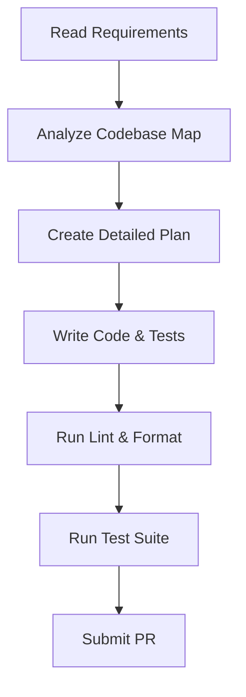

<!-- template-version: 0.0.0 -->

# AI Agent Guidelines — payroll-web

_Generated 2026-05-25 — v0.0.0_
Welcome! This document provides guidelines, conventions, and instruction workflows for AI coding assistants (like Cursor, Claude, Gemini, or Copilot) operating on the **payroll-web** codebase.

> **SMB Payroll is a web-based payroll management system for small-to-medium businesses. It handles employee management, time tracking, payroll computation, government remittance reporting, and payslip generation.**

---

## 🚀 Tech Stack Profile

This project uses the following technical stack configuration:

-   **Frontend Framework**: `React + Vite`
-   **Backend Framework**: `Firebase` (primarily Cloud Functions for serverless logic)
-   **Database**: `Firestore`
-   **Authentication**: `Firebase Auth`
-   **State Management**: `Zustand`
-   **Testing Framework**: `Vitest` (`@testing-library/react` for UI)
-   **Package Manager**: `yarn`

---

## 🛠️ Command Reference

Use these commands for development, linting, formatting, and testing. Do **NOT** use alternate commands unless requested.

| Action                   | Command           | Description                                    |
| :----------------------- | :---------------- | :--------------------------------------------- |
| **Install Dependencies** | `yarn install`    | Installs all project dependencies.             |
| **Run Dev Server**       | `yarn run dev`    | Starts the Vite development server.            |
| **Build Project**        | `yarn run build`  | Builds the production-ready React application. |
| **Lint Code**            | `yarn run lint`   | Checks code for linting errors.                |
| **Format Code**          | `yarn run format` | Formats code using Prettier.                   |
| **Run Tests**            | `yarn run test`   | Executes all Vitest test suites.               |

---

## 📝 Rules of Engagement

> [!IMPORTANT]
>
> ### 1. Code Style & Architecture
>
> -   Respect the existing directory structure defined in [CODEBASE_MAP.md](CODEBASE_MAP.md).
> -   Keep React components modular and focused. Avoid giant multi-hundred line files.
> -   Prioritize functional React components and hooks (`useState`, `useEffect`, `useCallback`, `useMemo`, `useContext`, custom hooks).
> -   **Naming Conventions**:
    -   React components: `PascalCase` (e.g., `EmployeeList`, `TimeEntryForm`).
    -   JavaScript variables, functions, Zustand actions: `camelCase`.
    -   Firestore collection/document IDs, field names: `camelCase` (unless an existing standard dictates `snake_case` for specific external integrations).
    -   Files: `kebab-case` for components (e.g., `employee-list.jsx`), `camelCase` for utility files (e.g., `authService.js`).
> -   Do not write generic or boilerplate comments (e.g., `// This function adds two numbers`). Write comments only for non-obvious business logic, complex algorithms, or architectural decisions.
> -   Environment variables should be prefixed with `VITE_` for client-side use and accessed via `import.meta.env`.
>
> ### 2. Dependency Management
>
> -   Always install dependencies using **`yarn`**. Never use `npm` or `pnpm`.
> -   Do not add new dependencies without assessing their impact on bundle size, security, and project maintainability. Prefer existing utility functions or small custom implementations over new libraries for minor functionalities.
>
> ### 3. Errors and Safety
>
> -   Handle all error paths explicitly. Do not use generic catch-alls (`catch (e) {}`) without logging, re-throwing, or providing user feedback.
> -   Specifically, handle `FirebaseError` objects to provide user-friendly messages.
> -   Ensure all user input is sanitized and validated on both the client-side (using form libraries or custom logic) and, critically, on the server-side (Firebase Cloud Functions, Firestore Security Rules). Refer to the standards in [API_CONTRACTS.md](API_CONTRACTS.md).
> -   Avoid exposing sensitive information (API keys, service account credentials) in client-side code.

---

## 🔥 Firebase-Specific Guidelines

> [!WARNING]
>
> ### 1. Firestore Security Rules
>
> -   Never write client-side code that bypasses security rules. All data access must be governed by rules.
> -   Validate all writes with `request.auth` (to ensure user is authenticated and authorized) and `request.resource.data` (to validate data structure and content) in security rules.
> -   Use `onCall` Cloud Functions for sensitive operations or complex transactions that require elevated privileges or cannot be safely performed directly from the client.
>
>     ```firestore
>     // Example Firestore Security Rule:
>     rules_version = '2';
>     service cloud.firestore {
>       match /databases/{database}/documents {
>         match /companies/{companyId}/employees/{employeeId} {
>           allow read: if request.auth != null && request.auth.uid == get(/databases/$(database)/documents/companies/$(companyId)).data.ownerId;
>           allow create: if request.auth != null && request.auth.uid == get(/databases/$(database)/documents/companies/$(companyId)).data.ownerId
>                         && request.resource.data.firstName is string
>                         && request.resource.data.lastName is string;
>           allow update: if request.auth != null && request.auth.uid == get(/databases/$(database)/documents/companies/$(companyId)).data.ownerId
>                         && request.resource.data.keys().hasAll(['firstName', 'lastName']);
>           allow delete: if false; // Deletion typically handled by Cloud Function
>         }
>       }
>     }
>     ```
>
> ### 2. Firebase Admin SDK & Cloud Functions
>
> -   Admin SDK operations should only run in trusted server environments (Firebase Cloud Functions).
> -   Never expose Admin SDK credentials to the client.
> -   Use Cloud Functions for:
    -   Complex business logic (e.g., payroll computation, report generation).
    -   Trigger-based actions (e.g., sending notifications on data changes).
    -   Operations requiring elevated privileges (e.g., user deletion, sensitive data writes).
>
> ### 3. Firestore Data Modeling
>
> -   Avoid deeply nested collections (max 2-3 levels). Prefer top-level collections or subcollections where logical.
> -   Use composite indexes for complex queries involving multiple `where` clauses or `orderBy` clauses. These must be created in the Firebase console or via CLI.
> -   **Collection Naming**: Use plural, `camelCase` (e.g., `employees`, `timeEntries`).
> -   **Document IDs**: Prefer auto-generated IDs for most documents. Use custom IDs only when a natural, unique identifier exists (e.g., `users/{uid}`).
> -   Consider data denormalization for frequently accessed read patterns to minimize reads and complexity, especially for summary data.
>
> ### 4. Firebase Authentication
>
> -   Utilize `onAuthStateChanged` to manage user sessions and protect routes in React.
> -   Store minimal user profile data (e.g., `displayName`, `email`, `photoURL`) in Firebase Auth, and more detailed application-specific profiles (e.g., `companyId`, `role`) in a dedicated `users` Firestore collection, linked by `uid`.
> -   Implement proper sign-up, sign-in, password reset, and sign-out flows using `firebase/auth` SDK functions.

---

## ⚛️ React & Zustand Best Practices

### 1. React Component Structure & Logic

-   **Functional Components**: Always use functional components with React Hooks.
-   **Props**: Clearly define props using TypeScript (if enabled) or JSDoc comments. Avoid excessive prop drilling; use Zustand for global state or `Context` for localized state.
-   **Styling**: Use consistent styling approaches. (e.g., CSS modules, Tailwind CSS, or component-scoped CSS).
-   **Error Boundaries**: Implement React Error Boundaries for gracefully handling rendering errors in parts of the UI.
-   **Lazy Loading**: Use `React.lazy` and `Suspense` for code splitting and improving initial load times, especially for large components or routes.

### 2. State Management with Zustand

-   **Store Definition**: Define Zustand stores in `src/store` directory. Each store should represent a logical domain (e.g., `authStore.js`, `employeeStore.js`, `timeTrackingStore.js`).
-   **Immutability**: Always update state immutably. Use spread operators or functions like `immer` (if integrated) to avoid direct state mutation.
-   **Actions**: Encapsulate state mutations within actions defined in the store.
-   **Selectors**: For derived state, create selector functions within the store or use `useStore` with a selector function to optimize re-renders.

    ```javascript
    // src/store/authStore.js
    import { create } from 'zustand';
    import { auth } from '../firebase'; // Assuming firebase.js exports auth instance

    export const useAuthStore = create((set) => ({
      user: null,
      loading: true,
      login: async (email, password) => {
        set({ loading: true });
        try {
          const userCredential = await auth.signInWithEmailAndPassword(email, password);
          set({ user: userCredential.user, loading: false });
          return userCredential.user;
        } catch (error) {
          console.error("Login failed:", error);
          set({ user: null, loading: false });
          throw error;
        }
      },
      logout: async () => {
        set({ loading: true });
        await auth.signOut();
        set({ user: null, loading: false });
      },
      setUser: (user) => set({ user, loading: false }),
    }));

    // Example usage in a React component
    // import { useAuthStore } from '../store/authStore';
    // const { user, loading, logout } = useAuthStore();
    ```

### 3. Data Fetching & Real-time Sync

-   Use `useEffect` hook for data fetching. For Firestore, leverage its real-time capabilities with `onSnapshot` listeners.
-   Ensure `onSnapshot` listeners are properly unsubscribed when components unmount to prevent memory leaks.
-   Handle loading and error states explicitly during data fetching operations.

    ```javascript
    // Example Firestore data fetching with real-time listener
    import React, { useEffect, useState } from 'react';
    import { db } from '../firebase'; // Assuming firebase.js exports db instance

    function EmployeeList() {
      const [employees, setEmployees] = useState([]);
      const [loading, setLoading] = useState(true);
      const [error, setError] = useState(null);

      useEffect(() => {
        const unsubscribe = db.collection('employees')
          .where('companyId', '==', 'yourCompanyId') // Example filter
          .orderBy('lastName')
          .onSnapshot(
            (snapshot) => {
              const employeeData = snapshot.docs.map(doc => ({
                id: doc.id,
                ...doc.data()
              }));
              setEmployees(employeeData);
              setLoading(false);
            },
            (err) => {
              console.error("Error fetching employees:", err);
              setError(err);
              setLoading(false);
            }
          );

        // Cleanup: unsubscribe from the listener when the component unmounts
        return () => unsubscribe();
      }, []); // Empty dependency array means this runs once on mount

      if (loading) return <p>Loading employees...</p>;
      if (error) return <p>Error: {error.message}</p>;

      return (
        <div>
          <h2>Employees</h2>
          <ul>
            {employees.map(employee => (
              <li key={employee.id}>{employee.firstName} {employee.lastName}</li>
            ))}
          </ul>
        </div>
      );
    }
    ```

---

## 🧪 Testing with Vitest

### 1. Unit Testing Components with `@testing-library/react`

-   Focus on testing component behavior from a user's perspective, not internal implementation details.
-   Use `render`, `screen`, and `fireEvent` from `@testing-library/react`.
-   Mock Firebase/Firestore SDK calls using `vi.mock` to isolate component tests from actual backend interactions.
-   Ensure accessibility by querying elements using `getByRole`, `getByLabelText`, `getByText`, etc.

    ```javascript
    // Example: src/components/auth/LoginForm.test.jsx
    import { render, screen, fireEvent } from '@testing-library/react';
    import { vi } from 'vitest';
    import LoginForm from './LoginForm';
    import { useAuthStore } from '../../store/authStore';

    // Mock the auth store for isolated testing
    vi.mock('../../store/authStore', () => ({
      useAuthStore: vi.fn(),
    }));

    describe('LoginForm', () => {
      const mockLogin = vi.fn();
      const mockSetUser = vi.fn();

      beforeEach(() => {
        useAuthStore.mockReturnValue({
          user: null,
          loading: false,
          login: mockLogin,
          setUser: mockSetUser,
        });
      });

      afterEach(() => {
        vi.clearAllMocks();
      });

      it('renders email and password fields', () => {
        render(<LoginForm />);
        expect(screen.getByLabelText(/email/i)).toBeInTheDocument();
        expect(screen.getByLabelText(/password/i)).toBeInTheDocument();
        expect(screen.getByRole('button', { name: /log in/i })).toBeInTheDocument();
      });

      it('calls login function on form submission with correct credentials', async () => {
        render(<LoginForm />);

        fireEvent.change(screen.getByLabelText(/email/i), { target: { value: 'test@example.com' } });
        fireEvent.change(screen.getByLabelText(/password/i), { target: { value: 'password123' } });
        fireEvent.click(screen.getByRole('button', { name: /log in/i }));

        expect(mockLogin).toHaveBeenCalledWith('test@example.com', 'password123');
      });
    });
    ```

### 2. Testing Zustand Stores

-   Test store logic directly by importing the store and calling its actions.
-   Verify state changes and side effects (if any, like API calls).
-   Ensure actions handle errors gracefully.

    ```javascript
    // Example: src/store/authStore.test.js
    import { vi, describe, it, expect, beforeEach } from 'vitest';
    import { useAuthStore } from './authStore';
    import { auth } from '../firebase'; // Assuming firebase.js exports auth instance

    // Mock Firebase auth methods
    vi.mock('../firebase', () => ({
      auth: {
        signInWithEmailAndPassword: vi.fn(),
        signOut: vi.fn(),
      },
    }));

    describe('useAuthStore', () => {
      beforeEach(() => {
        useAuthStore.setState({ user: null, loading: false }); // Reset state before each test
        vi.clearAllMocks();
      });

      it('should have initial state', () => {
        const { user, loading } = useAuthStore.getState();
        expect(user).toBeNull();
        expect(loading).toBe(false);
      });

      it('should handle login success', async () => {
        const mockUser = { uid: '123', email: 'test@example.com' };
        auth.signInWithEmailAndPassword.mockResolvedValueOnce({ user: mockUser });

        await useAuthStore.getState().login('test@example.com', 'password123');

        const { user, loading } = useAuthStore.getState();
        expect(user).toEqual(mockUser);
        expect(loading).toBe(false);
        expect(auth.signInWithEmailAndPassword).toHaveBeenCalledWith('test@example.com', 'password123');
      });

      it('should handle login failure', async () => {
        const error = new Error('Invalid credentials');
        auth.signInWithEmailAndPassword.mockRejectedValueOnce(error);

        await expect(useAuthStore.getState().login('test@example.com', 'wrongpassword'))
          .rejects.toThrow(error);

        const { user, loading } = useAuthStore.getState();
        expect(user).toBeNull();
        expect(loading).toBe(false);
      });

      it('should handle logout', async () => {
        useAuthStore.setState({ user: { uid: '123' }, loading: false });
        auth.signOut.mockResolvedValueOnce();

        await useAuthStore.getState().logout();

        const { user, loading } = useAuthStore.getState();
        expect(user).toBeNull();
        expect(loading).toBe(false);
        expect(auth.signOut).toHaveBeenCalled();
      });
    });
    ```

---

## 🧑‍💻 Task Execution Workflow

Before implementing changes, verify against this workflow:



1.  **Understand Context**: Read [ARCHITECTURE.md](ARCHITECTURE.md) and [BUSINESS_RULES.md](BUSINESS_RULES.md) thoroughly.
2.  **Implement**: Write cleaner, self-documenting code. Create new tests or update existing ones to cover your changes.
3.  **Verify**: Ensure that `yarn run lint` and `yarn run format` pass with zero warnings/errors, and all tests pass.

---

_Documentation generated by [create-agent-docs](https://github.com/chesteralan/create-agent-docs) v0.0.0 on 2026-05-25._
