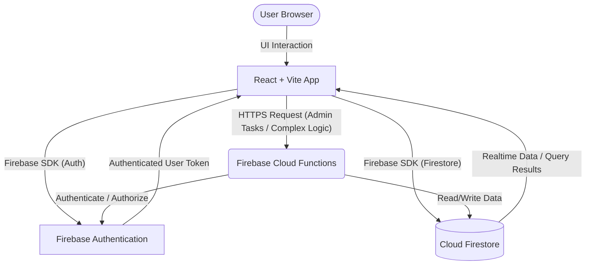

<!-- template-version: 0.0.0 -->

# Architecture Blueprint — payroll-web

_Generated 2026-05-25 — v0.0.0_
This document details the high-level architecture, data flows, and fundamental design decisions for the **payroll-web** project, a web-based payroll management system for small-to-medium businesses. It aims to provide a clear understanding for developers, stakeholders, and future maintainers.

> **SMB Payroll is a web-based payroll management system for small-to-medium businesses. It handles employee management, time tracking, payroll computation, government remittance reporting, and payslip generation.**

---

## 🏛️ 1. System Overview

The **payroll-web** system adopts a modern, serverless-first architecture leveraging the Firebase ecosystem for rapid development, scalability, and reduced operational overhead. This approach allows the frontend application to directly interact with backend services through the Firebase SDK, minimizing the need for a custom API server.

-   **Frontend Layer**: Developed with `React` for a dynamic user interface, bundled and served efficiently by `Vite`.
-   **Backend / Integration Layer**: Primarily handled by `Firebase` services, including direct client-side interactions with Firestore and Firebase Authentication, supplemented by `Firebase Cloud Functions` for server-side logic and secure operations.
-   **Database Layer**: `Cloud Firestore`, a NoSQL document database, provides flexible and scalable data storage.
-   **Authentication**: `Firebase Authentication` manages user identity, sign-up, sign-in, and session management.
-   **State Management**: `Zustand` is used for efficient and lightweight global state management within the React application.
-   **Testing Framework**: `Vitest` is employed for unit and integration testing of the frontend and utility logic.
-   **Package Manager**: `yarn` is used for dependency management and script execution.

---

## 🗺️ 2. System Topology & Data Flow

The architecture is designed as a single-page application (SPA) where the client-side React application directly communicates with Firebase services.



**Flow Explanation:**

1.  **User Interaction**: A user interacts with the UI rendered by the `React + Vite` application in their browser.
2.  **Authentication**: For protected resources, the `ClientApp` uses the `Firebase SDK` to interact with `Firebase Authentication`. Upon successful authentication, a user token is issued and managed by the SDK.
3.  **Data Access (Client-side)**: The `ClientApp` directly reads from and writes to `Cloud Firestore` using the `Firebase SDK`. All direct client access is strictly governed by `Firestore Security Rules`.
4.  **Server-side Logic (Cloud Functions)**: For complex business logic (e.g., payroll computation, generating reports, sensitive data operations, scheduled tasks), the `ClientApp` invokes `Firebase Cloud Functions` via HTTPS. These functions execute server-side, can access `Firestore` and other Firebase services, and enforce business rules with higher privileges and security.
5.  **Realtime Updates**: `Cloud Firestore` provides realtime data synchronization, allowing the `ClientApp` to subscribe to data changes and update the UI instantly without manual polling.

---

## 🧱 3. Core Architecture Layers

### 3.1. Frontend Layer: React + Vite

The user-facing application is a Single-Page Application (SPA) built with React, leveraging Vite for a fast development experience and optimized builds.

#### 3.1.1. Structure & Components

The frontend codebase (`/src`) is organized to promote modularity, reusability, and maintainability.

-   `src/assets`: Static assets like images, icons.
-   `src/components`: Reusable UI components (e.g., `Button`, `Modal`, `EmployeeCard`).
-   `src/features`: Domain-specific features, encapsulating related components, hooks, and logic (e.g., `features/employee-management`, `features/time-tracking`).
-   `src/hooks`: Custom React hooks for shared logic.
-   `src/pages`: Top-level components representing distinct application views (e.g., `pages/DashboardPage`, `pages/EmployeeListPage`).
-   `src/stores`: Zustand stores for global state management.
-   `src/services`: Utility functions for interacting with Firebase SDKs (e.g., `services/auth`, `services/firestore`).
-   `src/utils`: General utility functions.
-   `src/App.jsx`: Main application component, typically handling routing.
-   `src/main.jsx`: Entry point for the React application.

#### 3.1.2. State Management: Zustand

`Zustand` is used for managing global application state, offering a minimalist and performant approach. Each major domain or feature often has its own store.

**Example: Authentication Store (`src/stores/authStore.js`)**

```javascript
import { create } from 'zustand';
import { auth } from '../services/firebase'; // Firebase Auth instance

export const useAuthStore = create((set) => ({
  user: null,
  loading: true,
  error: null,

  setUser: (userData) => set({ user: userData, loading: false, error: null }),
  setLoading: (isLoading) => set({ loading: isLoading }),
  setError: (err) => set({ error: err, loading: false }),

  // Example: Listen to Firebase Auth state changes
  initAuthListener: () => {
    set({ loading: true });
    const unsubscribe = auth.onAuthStateChanged((firebaseUser) => {
      if (firebaseUser) {
        set({ user: {
          uid: firebaseUser.uid,
          email: firebaseUser.email,
          displayName: firebaseUser.displayName,
          // Add custom claims or profile data if available
        }, loading: false, error: null });
      } else {
        set({ user: null, loading: false, error: null });
      }
    });
    // Return unsubscribe function for cleanup
    return unsubscribe;
  },

  // Example: Logout action
  logout: async () => {
    try {
      await auth.signOut();
      set({ user: null, error: null });
    } catch (err) {
      console.error("Logout error:", err);
      set({ error: err.message });
    }
  },
}));
```

#### 3.1.3. Routing

Client-side routing is handled using `react-router-dom`, defining routes for different application pages and managing navigation. Protected routes are implemented by checking the authentication state from `useAuthStore`.

#### 3.1.4. Build & Development with Vite

`Vite` provides a rapid development server and an optimized build process.
Environment variables are managed via `.env` files and exposed to the client-side application.

**Example: `.env.development`**

```
VITE_FIREBASE_API_KEY="YOUR_DEV_API_KEY"
VITE_FIREBASE_AUTH_DOMAIN="your-dev-project.firebaseapp.com"
VITE_FIREBASE_PROJECT_ID="your-dev-project-id"
# ... other Firebase config
```

These variables are accessed in the code using `import.meta.env.VITE_FIREBASE_API_KEY`.

#### 3.1.5. Interacting with Firebase SDKs

The frontend directly uses the Firebase JavaScript SDKs for Authentication and Firestore operations. This involves initializing Firebase and then calling specific methods (e.g., `firebase/auth`, `firebase/firestore`).

**Example: Firebase initialization (`src/services/firebase.js`)**

```javascript
import { initializeApp } from 'firebase/app';
import { getAuth } from 'firebase/auth';
import { getFirestore } from 'firebase/firestore';

const firebaseConfig = {
  apiKey: import.meta.env.VITE_FIREBASE_API_KEY,
  authDomain: import.meta.env.VITE_FIREBASE_AUTH_DOMAIN,
  projectId: import.meta.env.VITE_FIREBASE_PROJECT_ID,
  storageBucket: import.meta.env.VITE_FIREBASE_STORAGE_BUCKET,
  messagingSenderId: import.meta.env.VITE_FIREBASE_MESSAGING_SENDER_ID,
  appId: import.meta.env.VITE_FIREBASE_APP_ID,
};

const app = initializeApp(firebaseConfig);
export const auth = getAuth(app);
export const db = getFirestore(app);
```

### 3.2. Backend & Integration Layer: Firebase Ecosystem

This layer primarily leverages Firebase's managed services, reducing the need for traditional server infrastructure.

#### 3.2.1. Firebase Project Setup

The project is configured within the Google Cloud Platform/Firebase Console. Key services enabled include:
-   **Authentication**: For user management.
-   **Firestore**: For database storage.
-   **Cloud Functions**: For serverless backend logic.
-   **Hosting**: For deploying the frontend application.

#### 3.2.2. Authentication: Firebase Auth

`Firebase Auth` provides robust user authentication, supporting various providers (Email/Password, Google Sign-In, etc.).

-   **User Management**: Handles user registration, login, password resets, and profile updates.
-   **Session Management**: Automatically manages user sessions, providing a user token (ID token) that can be used for authorizing requests to Firestore and Cloud Functions.
-   **Integration**: Seamlessly integrated with the `useAuthStore` in the frontend and used by `Firestore Security Rules` and `Cloud Functions` to identify and authorize users.

#### 3.2.3. Serverless Logic: Firebase Cloud Functions

`Firebase Cloud Functions` are used for backend logic that requires elevated privileges, complex computations, or secure operations that cannot be performed directly from the client.

**Use Cases for `payroll-web`:**

-   **Payroll Computation**: Calculating gross pay, deductions, taxes, and net pay. This sensitive logic must run server-side to prevent tampering and ensure accuracy.
-   **Government Remittance Reporting**: Generating aggregated reports for tax authorities or other government bodies.
-   **Payslip Generation**: Securely generating and potentially storing PDF payslips.
-   **Scheduled Tasks**: Automating monthly payroll runs, sending payment reminders, or data cleanup.
-   **Webhooks**: Integrating with third-party services (e.g., payment gateways).

**Example: A simplified Cloud Function for payroll calculation (`functions/index.js`)**

```javascript
const functions = require('firebase-functions');
const admin = require('firebase-admin');
admin.initializeApp();

exports.calculatePayroll = functions.https.onCall(async (data, context) => {
  // 1. Authenticate and authorize the user
  if (!context.auth) {
    throw new functions.https.HttpsError('unauthenticated', 'The function must be called while authenticated.');
  }
  const userId = context.auth.uid;
  // Further authorization checks: e.g., only admins can trigger payroll calculation
  const userDoc = await admin.firestore().collection('users').doc(userId).get();
  if (!userDoc.exists || userDoc.data().role !== 'admin') {
    throw new functions.https.HttpsError('permission-denied', 'Only admin users can calculate payroll.');
  }

  // 2. Input validation
  const { employeeId, periodStartDate, periodEndDate } = data;
  if (!employeeId || !periodStartDate || !periodEndDate) {
    throw new functions.https.HttpsError('invalid-argument', 'Missing required payroll parameters.');
  }

  // 3. Perform complex payroll logic (simplified example)
  try {
    const employeeRef = admin.firestore().collection('employees').doc(employeeId);
    const employeeSnap = await employeeRef.get();
    if (!employeeSnap.exists) {
      throw new functions.https.HttpsError('not-found', 'Employee not found.');
    }
    const employeeData = employeeSnap.data();

    // Fetch timesheet data for the period
    const timesheetQuery = await admin.firestore().collection('timesheets')
      .where('employeeId', '==', employeeId)
      .where('date', '>=', new Date(periodStartDate))
      .where('date', '<=', new Date(periodEndDate))
      .get();

    let totalHours = 0;
    timesheetQuery.forEach(doc => {
      totalHours += doc.data().hoursWorked;
    });

    const hourlyRate = employeeData.hourlyRate || 20; // Default rate
    const grossPay = totalHours * hourlyRate;
    const taxes = grossPay * 0.15; // Example 15% tax
    const netPay = grossPay - taxes;

    // 4. Store the payroll record
    const payrollRef = await admin.firestore().collection('payrolls').add({
      employeeId,
      periodStartDate: new Date(periodStartDate),
      periodEndDate: new Date(periodEndDate),
      grossPay,
      taxes,
      netPay,
      status: 'processed',
      createdAt: admin.firestore.FieldValue.serverTimestamp(),
      processedBy: userId,
    });

    return { success: true, payrollId: payrollRef.id, netPay };
  } catch (error) {
    console.error("Error calculating payroll:", error);
    throw new functions.https.HttpsError('internal', 'Failed to calculate payroll.', error.message);
  }
});
```

### 3.3. Data & Storage Layer: Cloud Firestore

`Cloud Firestore` serves as the primary database, offering a flexible, scalable, and performant NoSQL document-model database.

#### 3.3.1. Data Model Principles

-   **Collections and Documents**: Data is organized into collections (e.g., `employees`, `users`, `payrolls`) which contain documents. Each document is a lightweight record containing fields (key-value pairs) and can also contain subcollections.
-   **Denormalization**: To optimize for read performance, data is often denormalized where necessary, duplicating relevant fields across related documents to reduce joins.
-   **Referencing**: Relationships between collections are typically managed via document IDs (e.g., an `employee` document might have an `organizationId` field, or a `payroll` document might have an `employeeId` field).
-   **Scalability**: Designed for massive scale, Firestore automatically shards data and handles replication.

#### 3.3.2. Key Data Models (Examples)

-   **`users` collection**: Stores user profiles, linked to Firebase Authentication UIDs.
    ```json
    // users/{userId}
    {
      "uid": "firebase-auth-uid",
      "email": "user@example.com",
      "displayName": "John Doe",
      "role": "admin" | "manager" | "employee",
      "organizationId": "org_abc123",
      "createdAt": "timestamp"
    }
    ```
-   **`organizations` collection**: Stores details about each SMB.
    ```json
    // organizations/{organizationId}
    {
      "name": "Acme Corp",
      "address": "123 Main St",
      "contactEmail": "hr@acme.com",
      "taxId": "12-3456789",
      "createdAt": "timestamp"
    }
    ```
-   **`employees` collection**: Stores employee-specific data.
    ```json
    // employees/{employeeId}
    {
      "organizationId": "org_abc123",
      "userId": "firebase-auth-uid" | null, // Link to user if they have portal access
      "firstName": "Jane",
      "lastName": "Smith",
      "employeeId": "EMP001", // Internal employee ID
      "position": "Software Engineer",
      "hourlyRate": 25.00,
      "salary": null,
      "hireDate": "2023-01-15",
      "status": "active",
      "bankAccount": {
        "accountNumber": "...",
        "routingNumber": "..."
      },
      "taxInfo": { /* ... */ },
      "createdAt": "timestamp"
    }
    ```
-   **`timesheets` collection**: Records employee work hours.
    ```json
    // timesheets/{timesheetId}
    {
      "employeeId": "emp_uuid_abc",
      "organizationId": "org_abc123",
      "date": "2024-05-20",
      "startTime": "09:00",
      "endTime": "17:00",
      "hoursWorked": 8.0,
      "status": "pending" | "approved" | "rejected",
      "approvedBy": "manager_uid" | null,
      "createdAt": "timestamp"
    }
    ```
-   **`payrolls` collection**: Stores computed payroll records.
    ```json
    // payrolls/{payrollId}
    {
      "employeeId": "emp_uuid_abc",
      "organizationId": "org_abc123",
      "periodStartDate": "2024-05-01",
      "periodEndDate": "2024-05-15",
      "grossPay": 2000.00,
      "deductions": {
        "taxes": 300.00,
        "healthInsurance": 50.00
      },
      "netPay": 1650.00,
      "status": "processed" | "paid" | "failed",
      "payslipUrl": "gs://bucket/payslips/...", // Link to generated payslip in Cloud Storage
      "processedAt": "timestamp",
      "processedBy": "admin_uid"
    }
    ```

#### 3.3.3. Querying & Indexing

-   Firestore's strength lies in its ability to perform fast queries on indexed fields.
-   Compound indexes are automatically suggested by the Firebase Console for complex queries involving multiple `where()` clauses or `orderBy()` clauses.
-   Queries are shallow; they only retrieve documents from a single collection (or subcollection). To get related data, multiple queries or denormalization are used.

---

## 🔒 4. Security & Authorization

Security is paramount for a payroll system. The architecture relies heavily on Firebase's built-in security features.

### 4.1. Firebase Authentication

-   **User Identity**: Provides a secure and reliable way to identify users.
-   **ID Tokens**: Upon login, Firebase Auth issues an ID token. This token is automatically attached to Firestore requests and can be verified by Cloud Functions to determine the user's identity and authorization.
-   **Custom Claims**: For role-based access control (RBAC), custom claims can be added to user ID tokens (e.g., `admin: true`, `organizationId: "org_abc123"`), allowing Firestore Security Rules and Cloud Functions to easily check user roles.

### 4.2. Firestore Security Rules

These rules are critical for enforcing data access control directly at the database level, ensuring clients can only read/write data they are authorized to. They are written in a JavaScript-like syntax and deployed via the Firebase CLI.

**Principles:**

-   **Default Deny**: All access is denied by default unless explicitly allowed.
-   **Authentication Check**: Ensure `request.auth != null` for authenticated access.
-   **Ownership**: Users can only read/write their own data (e.g., a user can only update their own profile).
-   **Role-Based Access**: Use custom claims or document fields to grant access based on user roles (e.g., only `admin` users can create new `employees`).
-   **Organization-Scoped Access**: Ensure users can only access data belonging to their `organizationId`.

**Example: Simplified Firestore Security Rules (`firestore.rules`)**

```firestore
rules_version = '2';
service cloud.firestore {
  match /databases/{database}/documents {

    // Helper function to check if user is authenticated
    function isAuthenticated() {
      return request.auth != null;
    }

    // Helper function to check if user is an admin
    function isAdmin() {
      return isAuthenticated() && get(/databases/$(database)/documents/users/$(request.auth.uid)).data.role == 'admin';
    }

    // Helper function to check if user belongs to the same organization as the document
    function isInOrganization(organizationId) {
      return isAuthenticated() && get(/databases/$(database)/documents/users/$(request.auth.uid)).data.organizationId == organizationId;
    }

    // Users Collection: Users can read their own profile, admins can read all
    match /users/{userId} {
      allow read: if isAuthenticated() && (userId == request.auth.uid || isAdmin());
      allow write: if isAuthenticated() && userId == request.auth.uid; // Users can update their own profile
    }

    // Organizations Collection: Read by all authenticated users, write by admins
    match /organizations/{organizationId} {
      allow read: if isAuthenticated();
      allow create, update, delete: if isAdmin();
    }

    // Employees Collection:
    // - Read: If user is admin OR manager OR is an employee within the same organization
    // - Create/Update/Delete: Only if user is an admin AND belongs to the same organization
    match /employees/{employeeId} {
      allow read: if isAuthenticated() && (isAdmin() || isInOrganization(resource.data.organizationId));
      allow create, update, delete: if isAdmin() && isInOrganization(request.resource.data.organizationId);
    }

    // Timesheets Collection:
    // - Read: If user is admin OR manager OR is the employee themselves
    // - Write: If user is the employee OR a manager/admin
    match /timesheets/{timesheetId} {
      allow read: if isAuthenticated() && (
        isAdmin() ||
        isInOrganization(resource.data.organizationId) && (resource.data.employeeId == request.auth.uid || get(/databases/$(database)/documents/users/$(request.auth.uid)).data.role == 'manager')
      );
      allow create: if isAuthenticated() && (
        isAdmin() ||
        isInOrganization(request.resource.data.organizationId) && (request.resource.data.employeeId == request.auth.uid)
      );
      allow update, delete: if isAuthenticated() && (
        isAdmin() ||
        (isInOrganization(resource.data.organizationId) && (resource.data.employeeId == request.auth.uid || get(/databases/$(database)/documents/users/$(request.auth.uid)).data.role == 'manager'))
      );
    }

    // Payrolls Collection:
    // - Read: If user is admin OR manager OR is the employee themselves
    // - Create/Update/Delete: Only if user is an admin
    match /payrolls/{payrollId} {
      allow read: if isAuthenticated() && (
        isAdmin() ||
        (isInOrganization(resource.data.organizationId) && (resource.data.employeeId == request.auth.uid || get(/databases/$(database)/documents/users/$(request.auth.uid)).data.role == 'manager'))
      );
      allow create, update, delete: if isAdmin();
    }

    // Additional rules for other collections...
  }
}
```

### 4.3. Input Validation

-   **Client-side Validation**: Provides immediate feedback to the user and prevents unnecessary requests. Libraries like Zod or Yup are ideal for defining schemas and validating form inputs.
-   **Server-side Validation**: Crucial for all data entering the system. `Firebase Cloud Functions` must perform robust validation on all incoming data (`data` argument in `onCall` functions) to ensure data integrity and security, even if client-side validation is bypassed. Firestore Security Rules also provide basic type and field validation.

### 4.4. Environment Variable Management

Sensitive keys (e.g., API keys for third-party services used by Cloud Functions) are stored securely as environment variables within Firebase Functions, not hardcoded. Client-side public keys are managed via `.env` files, which are not committed to source control (using `.gitignore`).

---

## ⚙️ 5. Development & Testing

### 5.1. Local Development Environment

-   **Vite Development Server**: For frontend development, providing hot module reloading.
    ```bash
    yarn dev
    ```
-   **Firebase Emulators**: A local suite for Auth, Firestore, and Cloud Functions. This allows developers to build and test the entire application locally without incurring cloud costs or affecting production data.
    ```bash
    firebase emulators:start
    ```
    The frontend application can be configured to connect to the emulators during development.

### 5.2. Testing Strategy: Vitest

`Vitest` is configured for unit and integration testing within the frontend application.

-   **Unit Tests**: For individual React components, custom hooks, utility functions, and Zustand stores.
-   **Integration Tests**: For interactions between components, services, and mocked Firebase SDK calls.
-   **Cloud Function Tests**: Separate unit tests for Firebase Cloud Functions (using `firebase-functions-test` or similar) to ensure server-side logic is correct and secure.

**Example: Vitest test for a Zustand store (`src/stores/authStore.test.js`)**

```javascript
import { describe, it, expect, beforeEach, vi } from 'vitest';
import { useAuthStore } from './authStore';
import { auth } from '../services/firebase'; // Mock this

// Mock Firebase Auth
vi.mock('../services/firebase', () => ({
  auth: {
    onAuthStateChanged: vi.fn(),
    signOut: vi.fn(() => Promise.resolve()),
  },
}));

describe('useAuthStore', () => {
  beforeEach(() => {
    // Reset the store state before each test
    useAuthStore.setState({ user: null, loading: true, error: null });
    vi.clearAllMocks();
  });

  it('should set user and loading state on auth state change', () => {
    const mockUser = { uid: '123', email: 'test@example.com' };
    auth.onAuthStateChanged.mockImplementationOnce((callback) => {
      callback(mockUser);
      return vi.fn(); // unsubscribe
    });

    const unsubscribe = useAuthStore.getState().initAuthListener();
    expect(useAuthStore.getState().user.uid).toBe('123');
    expect(useAuthStore.getState().loading).toBe(false);
    unsubscribe();
  });

  it('should set user to null when no user is logged in', () => {
    auth.onAuthStateChanged.mockImplementationOnce((callback) => {
      callback(null);
      return vi.fn();
    });

    const unsubscribe = useAuthStore.getState().initAuthListener();
    expect(useAuthStore.getState().user).toBe(null);
    expect(useAuthStore.getState().loading).toBe(false);
    unsubscribe();
  });

  it('should handle logout correctly', async () => {
    useAuthStore.setState({ user: { uid: '123' } });
    await useAuthStore.getState().logout();
    expect(auth.signOut).toHaveBeenCalledTimes(1);
    expect(useAuthStore.getState().user).toBe(null);
  });
});
```

### 5.3. Key Development Commands

-   `yarn dev`: Starts the Vite development server for the frontend.
-   `yarn test`: Runs Vitest tests.
-   `yarn build`: Creates a production-ready build of the frontend application.
-   `firebase deploy --only hosting`: Deploys the frontend to Firebase Hosting.
-   `firebase deploy --only functions`: Deploys Cloud Functions.
-   `firebase deploy --only firestore:rules`: Deploys Firestore Security Rules.

---

## 🚀 6. Deployment Strategy

The entire application is designed to be deployed on Firebase, leveraging its fully managed services.

### 6.1. Frontend Deployment: Firebase Hosting

-   The `yarn build` command generates optimized static assets (`/dist` directory).
-   These assets are deployed to `Firebase Hosting`, a global CDN that provides fast and secure delivery of web content.
-   Automatic SSL certificates and custom domain support are included.

### 6.2. Backend Deployment: Firebase Services

-   **Cloud Firestore**: Database rules are deployed via `firebase deploy --only firestore:rules`. Data is managed directly within the Firestore console or programmatically.
-   **Firebase Authentication**: Configuration (e.g., enabled sign-in providers) is managed in the Firebase Console.
-   **Firebase Cloud Functions**: Functions are deployed via `firebase deploy --only functions`. They are automatically scaled and managed by Google Cloud.

---

## ✨ 7. Design Principles & Best Practices

-   **Modularity**: Codebase is structured into features, components, and services to enhance reusability and maintainability.
-   **Scalability**: Leveraging Firebase's serverless architecture, the application is designed to scale automatically with user demand without manual server provisioning.
-   **Performance**: Vite for fast builds, Firestore for real-time data and efficient queries, and Firebase Hosting for CDN-backed content delivery ensure a responsive user experience.
-   **Security by Design**: Emphasis on robust authentication, granular Firestore Security Rules, and server-side validation for critical operations.
-   **Developer Experience**: Use of modern tools like React, Vite, Zustand, and Vitest aims to provide an enjoyable and productive development workflow.
-   **Cost-Effectiveness**: The serverless model means paying only for resources consumed, which is highly efficient for SMB-focused applications.

---

_Documentation generated by [create-agent-docs](https://github.com/chesteralan/create-agent-docs) v0.0.0 on 2026-05-25._
