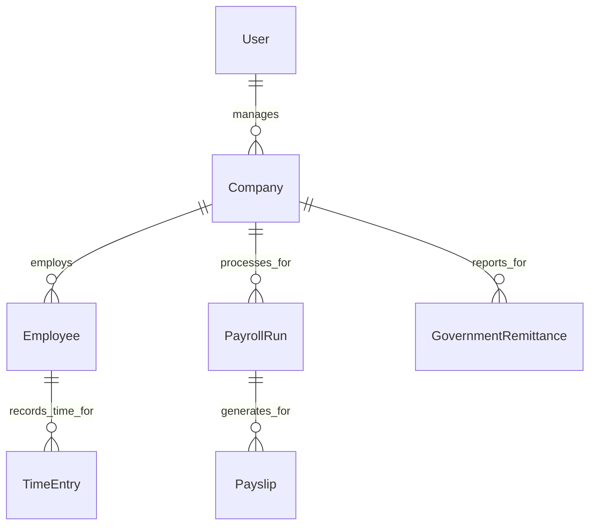

<!-- template-version: 0.0.0 -->

# Data Models — payroll-web

_Generated 2026-05-25 — v0.0.0_
This document defines the core data models, schemas, relationships, and collection structures used in the **payroll-web** system. It provides a comprehensive overview for developers working with data persistence and retrieval.

---

## 🗄️ Database Overview

**Engine**: `Firestore` (Part of Google Firebase)

Firestore is a NoSQL, document-oriented database that offers real-time data synchronization and offline support, making it an excellent choice for dynamic web applications like `payroll-web`. It stores data in documents, which are organized into collections. Documents can also contain subcollections, allowing for hierarchical data structures.

**Key Characteristics for `payroll-web`:**
*   **Scalability**: Designed to scale globally, handling a large number of concurrent users and data.
*   **Real-time Synchronization**: Frontend (React) can subscribe to data changes, ensuring UIs are always up-to-date.
*   **Flexible Schema**: As a NoSQL database, it allows for flexible schemas, which can evolve with the application. However, we aim for consistent typing using TypeScript.
*   **Integrated with Firebase Ecosystem**: Seamless integration with Firebase Authentication, Firebase Functions, and Firebase Storage.

---

## Core Entities & Schemas

The following are the primary data entities within `payroll-web`, detailing their fields, types, and descriptions. All `id` fields represent the Firestore document ID for that entity unless otherwise specified. `Timestamp` fields are Firestore `Timestamp` objects.

### 1. User

Represents a user account in the system, typically an administrator or business owner managing a company's payroll. Linked to Firebase Authentication.

| Field         | Type      | Description                                     |
| :------------ | :-------- | :---------------------------------------------- |
| `id`          | `string`  | Firebase Auth User UID (Document ID)            |
| `email`       | `string`  | User's email address (from Firebase Auth)       |
| `displayName` | `string`  | User's display name, if available               |
| `companyIds`  | `string[]`| Array of `companyId`s this user has access to   |
| `role`        | `string`  | User's role (e.g., `owner`, `admin`, `staff`)   |
| `createdAt`   | `Timestamp` | Date and time the user document was created   |
| `updatedAt`   | `Timestamp` | Last update date/time of the user document    |

### 2. Company

Represents an SMB client using the payroll system. Each company manages its own employees, payroll runs, and settings.

| Field                 | Type        | Description                                     |
| :-------------------- | :---------- | :---------------------------------------------- |
| `id`                  | `string`    | Unique Firestore Document ID                    |
| `name`                | `string`    | Legal company name                              |
| `businessAddress`     | `string`    | Company's primary business address              |
| `taxId`               | `string`    | Company's Tax ID (e.g., EIN, TIN)               |
| `contactEmail`        | `string`    | Primary contact email for the company           |
| `payrollFrequency`    | `string`    | Default payroll frequency (`weekly`, `bi-weekly`, `monthly`) |
| `nextPayrollDate`     | `Timestamp` | Suggested date for the next payroll run         |
| `ownerUserId`         | `string`    | Firebase Auth UID of the primary owner          |
| `settings`            | `object`    | JSON object for company-specific configurations (e.g., feature flags, default deductions) |
| `createdAt`           | `Timestamp` | Date and time the company was registered        |
| `updatedAt`           | `Timestamp` | Last update date/time of company details        |

### 3. Employee

Represents an employee of a registered `Company`.

| Field           | Type        | Description                                     |
| :-------------- | :---------- | :---------------------------------------------- |
| `id`            | `string`    | Unique Firestore Document ID                    |
| `companyId`     | `string`    | ID of the parent company                        |
| `firstName`     | `string`    | Employee's first name                           |
| `lastName`      | `string`    | Employee's last name                            |
| `email`         | `string`    | Employee's email address                        |
| `employeeId`    | `string`    | Internal employee ID assigned by the company    |
| `position`      | `string`    | Employee's job title                            |
| `hireDate`      | `Timestamp` | Date the employee was hired                     |
| `salaryType`    | `string`    | `hourly` or `salary`                            |
| `rate`          | `number`    | Hourly rate or annual salary                    |
| `paySchedule`   | `string`    | `weekly`, `bi-weekly`, `monthly` (can override company default) |
| `bankAccount`   | `object`    | `{ accountNumber: string, routingNumber: string }` (Sensitive, handle with care) |
| `status`        | `string`    | `active`, `inactive`, `terminated`              |
| `createdAt`     | `Timestamp` | Date and time the employee record was created   |
| `updatedAt`     | `Timestamp` | Last update date/time of employee details       |

### 4. TimeEntry

Records an employee's work hours for a specific period.

| Field         | Type        | Description                                     |
| :------------ | :---------- | :---------------------------------------------- |
| `id`          | `string`    | Unique Firestore Document ID                    |
| `employeeId`  | `string`    | ID of the employee                              |
| `companyId`   | `string`    | ID of the parent company                        |
| `date`        | `Timestamp` | Calendar date of the work                       |
| `startTime`   | `Timestamp` | Clock-in time                                   |
| `endTime`     | `Timestamp` | Clock-out time                                  |
| `hoursWorked` | `number`    | Calculated total hours worked (can include breaks) |
| `notes`       | `string`    | Optional notes for the time entry               |
| `status`      | `string`    | `pending`, `approved`, `rejected`               |
| `approvedBy`  | `string`    | User ID of the approver (if applicable)         |
| `createdAt`   | `Timestamp` | Date and time the entry was created             |
| `updatedAt`   | `Timestamp` | Last update date/time of the entry              |

### 5. PayrollRun

Represents a single instance of a payroll processing event for a `Company`.

| Field               | Type        | Description                                     |
| :------------------ | :---------- | :---------------------------------------------- |
| `id`                | `string`    | Unique Firestore Document ID                    |
| `companyId`         | `string`    | ID of the parent company                        |
| `payPeriodStart`    | `Timestamp` | Start date of the pay period                    |
| `payPeriodEnd`      | `Timestamp` | End date of the pay period                      |
| `payDate`           | `Timestamp` | Date employees will be paid                     |
| `status`            | `string`    | `draft`, `pending_approval`, `processed`, `paid`, `cancelled` |
| `totalGrossPay`     | `number`    | Sum of gross pay for all employees in this run  |
| `totalNetPay`       | `number`    | Sum of net pay for all employees in this run    |
| `generatedByUserId` | `string`    | User ID who initiated this payroll run          |
| `createdAt`         | `Timestamp` | Date and time the payroll run was created       |
| `updatedAt`         | `Timestamp` | Last update date/time of the payroll run        |

### 6. Payslip

Represents an individual payslip generated for an `Employee` as part of a `PayrollRun`.

| Field           | Type        | Description                                     |
| :-------------- | :---------- | :---------------------------------------------- |
| `id`            | `string`    | Unique Firestore Document ID                    |
| `payrollRunId`  | `string`    | ID of the parent payroll run                    |
| `employeeId`    | `string`    | ID of the employee this payslip belongs to      |
| `companyId`     | `string`    | ID of the parent company                        |
| `grossPay`      | `number`    | Employee's gross pay for the period             |
| `netPay`        | `number`    | Employee's net pay for the period               |
| `earnings`      | `object[]`  | Array of `{ type: string, amount: number }` (e.g., `regular`, `overtime`, `bonus`) |
| `deductions`    | `object[]`  | Array of `{ type: string, amount: number }` (e.g., `federal_tax`, `state_tax`, `health_insurance`) |
| `status`        | `string`    | `generated`, `distributed`, `viewed`            |
| `documentUrl`   | `string`    | URL to a PDF payslip stored in Firebase Storage (optional) |
| `createdAt`     | `Timestamp` | Date and time the payslip was generated         |
| `updatedAt`     | `Timestamp` | Last update date/time of the payslip record     |

### 7. GovernmentRemittance

Records details for tax and other government remittances required from the company.

| Field                 | Type        | Description                                     |
| :-------------------- | :---------- | :---------------------------------------------- |
| `id`                  | `string`    | Unique Firestore Document ID                    |
| `companyId`           | `string`    | ID of the parent company                        |
| `reportingPeriodStart`| `Timestamp` | Start date of the reporting period              |
| `reportingPeriodEnd`  | `Timestamp` | End date of the reporting period                |
| `dueDate`             | `Timestamp` | Date the remittance is due                      |
| `type`                | `string`    | Type of remittance (e.g., `federal_tax`, `state_tax`, `social_security`, `medicare`) |
| `amountDue`           | `number`    | Calculated amount due for this remittance       |
| `amountPaid`          | `number`    | Actual amount paid (can differ from `amountDue`) |
| `status`              | `string`    | `pending`, `filed`, `paid`, `overdue`           |
| `submissionDetails`   | `object`    | JSON object for submission confirmation, transaction IDs, etc. |
| `createdAt`           | `Timestamp` | Date and time the remittance record was created |
| `updatedAt`           | `Timestamp` | Last update date/time of the record             |

---

## 💻 Schema Definition & Typing (TypeScript)

To ensure type safety and consistency across the React frontend and any potential Firebase Functions (Node.js backend), TypeScript interfaces are defined for each entity. These interfaces should ideally reside in a shared library or a `types/` directory within the project.

```typescript
// src/types/firestore.ts
import { Timestamp } from 'firebase/firestore';

/** Represents a user account in the system. */
export interface User {
  id: string; // Firebase Auth UID
  email: string;
  displayName?: string;
  companyIds: string[];
  role: 'owner' | 'admin' | 'staff';
  createdAt: Timestamp;
  updatedAt: Timestamp;
}

/** Represents an SMB client company. */
export interface Company {
  id: string;
  name: string;
  businessAddress: string;
  taxId: string;
  contactEmail: string;
  payrollFrequency: 'weekly' | 'bi-weekly' | 'monthly';
  nextPayrollDate: Timestamp;
  ownerUserId: string;
  settings: {
    // Example settings
    enableTimeTracking?: boolean;
    defaultTaxRate?: number;
  };
  createdAt: Timestamp;
  updatedAt: Timestamp;
}

/** Represents an employee of a company. */
export interface Employee {
  id: string;
  companyId: string;
  firstName: string;
  lastName: string;
  email: string;
  employeeId: string; // Internal company employee ID
  position: string;
  hireDate: Timestamp;
  salaryType: 'hourly' | 'salary';
  rate: number; // Hourly rate or annual salary
  paySchedule: 'weekly' | 'bi-weekly' | 'monthly';
  bankAccount: {
    accountNumber: string;
    routingNumber: string;
  };
  status: 'active' | 'inactive' | 'terminated';
  createdAt: Timestamp;
  updatedAt: Timestamp;
}

/** Represents a single time entry for an employee. */
export interface TimeEntry {
  id: string;
  employeeId: string;
  companyId: string;
  date: Timestamp;
  startTime: Timestamp;
  endTime: Timestamp;
  hoursWorked: number;
  notes?: string;
  status: 'pending' | 'approved' | 'rejected';
  approvedBy?: string; // User ID of the approver
  createdAt: Timestamp;
  updatedAt: Timestamp;
}

// ... other interfaces for PayrollRun, Payslip, GovernmentRemittance
```

---

## 🌳 Firestore Collection Structure

Data in Firestore is organized into collections and documents. Subcollections are used to create hierarchical relationships, especially for data that is logically owned by a parent document (e.g., `employees` belonging to a `company`).

```
/users/{userId}
    (Document: User)

/companies/{companyId}
    (Document: Company)
    /employees/{employeeId}
        (Document: Employee)
        /timeEntries/{timeEntryId}
            (Document: TimeEntry)
    /payrollRuns/{payrollRunId}
        (Document: PayrollRun)
        /payslips/{payslipId}
            (Document: Payslip)
    /governmentRemittances/{remittanceId}
        (Document: GovernmentRemittance)
```

**Example CLI Command (Conceptual - for `firebase-tools`):**

To add a new company:
```bash
# This is a conceptual representation. In a real app, this would be done via client-side code or Firebase Functions.
# The `firebase-tools` CLI is primarily for deployment and management, not direct data manipulation.
# Example of adding a document using client-side JS:

# import { collection, addDoc, serverTimestamp } from "firebase/firestore";
# import { db } from "./firebaseConfig"; // Your Firestore instance

# const addNewCompany = async (companyData) => {
#   try {
#     const docRef = await addDoc(collection(db, "companies"), {
#       ...companyData,
#       createdAt: serverTimestamp(),
#       updatedAt: serverTimestamp(),
#     });
#     console.log("Document written with ID: ", docRef.id);
#   } catch (e) {
#     console.error("Error adding document: ", e);
#   }
# };
```

---

## 🔗 Key Relationships



**Explanation of Relationships:**
*   **User manages Company**: A `User` (owner/admin) can manage one or more `Company` entities.
*   **Company employs Employee**: Each `Employee` belongs to exactly one `Company`.
*   **Employee records_time_for TimeEntry**: `TimeEntry` documents are specific to an `Employee`.
*   **Company processes_for PayrollRun**: Each `PayrollRun` is executed for a specific `Company`.
*   **PayrollRun generates_for Payslip**: `Payslip` documents are generated as part of a `PayrollRun` for individual employees.
*   **Company reports_for GovernmentRemittance**: `GovernmentRemittance` records are tied to a specific `Company`.

---

## 🔒 Security Rules Considerations

Firestore Security Rules are critical for protecting data access. They ensure that users can only read and write data that they are authorized to access. Rules are written in a JavaScript-like syntax and deployed via the Firebase CLI.

**Example `firestore.rules` snippets:**

```firestore
rules_version = '2';
service cloud.firestore {
  match /databases/{database}/documents {

    // Users can only read/write their own user profile document
    match /users/{userId} {
      allow read, update, delete: if request.auth.uid == userId;
      allow create: if request.auth.uid != null; // Allow any authenticated user to create their own profile
    }

    // Companies can only be accessed by authenticated users belonging to that company
    match /companies/{companyId} {
      allow read: if request.auth.uid != null && get(/databases/$(database)/documents/users/$(request.auth.uid)).data.companyIds.hasAny([companyId]);
      allow create: if request.auth.uid != null; // Further refine: only owners can create companies
      allow update, delete: if request.auth.uid != null && get(/databases/$(database)/documents/companies/$(companyId)).data.ownerUserId == request.auth.uid;
    }

    // Employees are a subcollection of companies
    match /companies/{companyId}/employees/{employeeId} {
      allow read: if request.auth.uid != null && get(/databases/$(database)/documents/users/$(request.auth.uid)).data.companyIds.hasAny([companyId]);
      allow create, update, delete: if request.auth.uid != null && get(/databases/$(database)/documents/companies/$(companyId)).data.ownerUserId == request.auth.uid;
      // More granular rules could allow admins to create/update employees, not just owners.
    }

    // Add similar rules for payrollRuns, payslips, timeEntries, and governmentRemittances
    // ensuring they inherit access control from their parent company.
  }
}
```

**Deployment:**
To deploy updated security rules:
```bash
yarn firebase deploy --only firestore:rules
```

---

_Documentation generated by [create-agent-docs](https://github.com/chesteralan/create-agent-docs) v0.0.0 on 2026-05-25._
